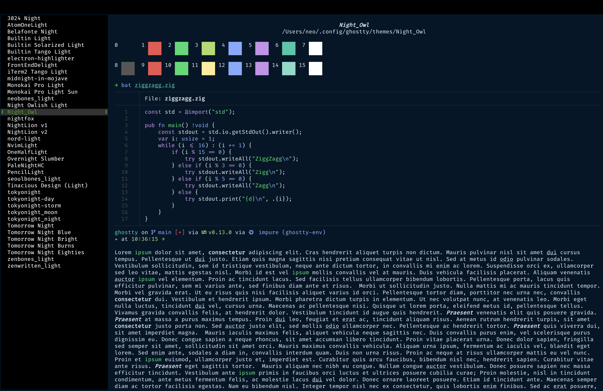

# Night Owl theme for Ghostty Terminal :night_with_stars: :owl:

A port of Sarah Drasner’s [Night Owl VS Code theme](https://github.com/sdras/night-owl-vscode-theme) for [Ghostty Terminal](https://ghostty.org/).

Inspired from Nick Cernis's [Night Owl port for iterm](https://github.com/nickcernis/iterm2-night-owl).



## Installation
1. Download the latest release ZIP file from the Releases section.
2. Extract the ZIP file, and you’ll find a file named `Night_Owl` inside.
3. Copy the `Night_Owl` file to your Ghostty config themes folder. The default path is usually `your_home_folder/.config/ghostty/themes/`.
4. If you don’t already have a ghostty config folder, kindly create it at the above location and then paste the file there.
5. Install [Ghostty Terminal](https://ghostty.org/) if you haven’t already.
6. Open Ghostty terminal.
7. Press <kbd>Cmd</kbd> + <kbd>,</kbd> to open the config file.
8. Add the following line to the config file:
    ```ini
        theme = Night_Owl
    ```
9. To apply the theme, press <kbd>Cmd</kbd> + <kbd>Shift</kbd> + <kbd>,</kbd> from the ghostty terminal to reload the config.
10. That’s it! You’ve successfully installed the stunning Night Owl theme for Ghostty terminal. Enjoy! ❤️

